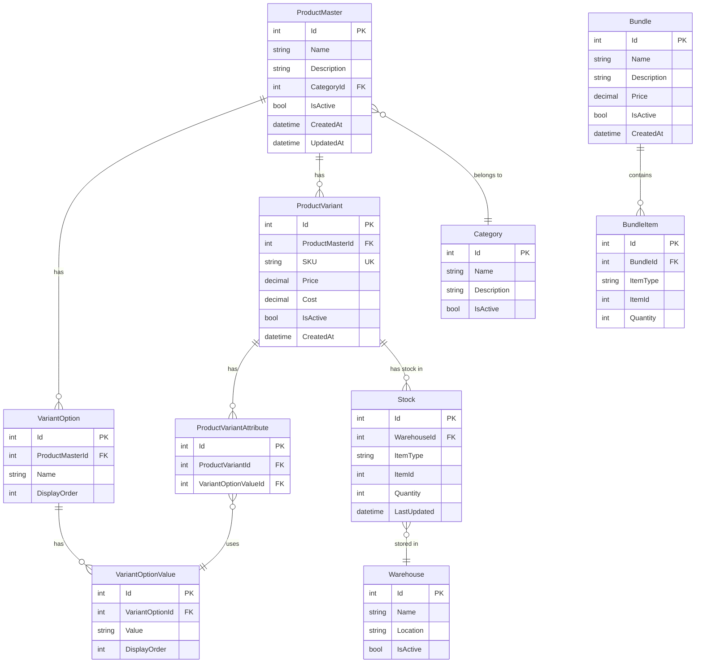

# FlowAccount - Product Variant & Bundle System

## 📋 ภาพรวมโปรเจกต์

**FlowAccount Co., Ltd. - Software Engineer Candidate Test Project**

โปรเจกต์นี้เป็นการออกแบบและพัฒนาระบบ **Product Variant** (สินค้ามีตัวเลือก) และ **Product Bundle** (ชุดสินค้า) 
ประกอบด้วย Backend API และ Angular Frontend

---

## 🎯 วัตถุประสงค์

พัฒนาระบบที่รองรับ:

1. **Product Variant** - สินค้าหลักที่มีตัวเลือกหลายแบบ (เช่น สี, ขนาด)
2. **Product Bundle** - การจัดชุดสินค้าหลายรายการขายรวมกัน
3. **การจัดการสต็อก** - คำนวณและจัดการสต็อกอย่างมีประสิทธิภาพ
4. **Transaction Management** - จัดการการตัดสต็อกและธุรกรรมที่ซับซ้อน

---

## 📝 คำอธิบายคุณสมบัติหลัก

### 1. Product Variant (สินค้ามีตัวเลือก)

**แนวคิด:** สินค้าหลัก (Product Master) หนึ่งชิ้นสามารถมี "ตัวเลือก" ได้หลายแบบ

**คุณสมบัติ:**
- แต่ละตัวเลือก (Variant) มี SKU, ราคา, และสต็อกเป็นของตัวเอง
- รองรับตัวเลือกหลายมิติ (เช่น สี × ขนาด)

**ตัวอย่าง:**
```
Product Master: เสื้อยืด
├─ Variant 1: เสื้อยืดสีแดง ไซส์ S (SKU: SHIRT-RED-S)
└─ Variant 2: เสื้อยืดสีน้ำเงิน ไซส์ M (SKU: SHIRT-BLUE-M)
```

### 2. Product Bundle (ชุดสินค้า)

**แนวคิด:** นำสินค้าหลายรายการ (สินค้าเดี่ยวหรือ Variant) มาจัดเป็นชุดขายรวมกัน

**คุณสมบัติ:**
- ชุดสินค้ามีราคากำหนดเอง
- การจัดการสต็อกขึ้นอยู่กับสต็อกของสินค้าส่วนประกอบ
- รองรับทั้ง Product และ Variant เป็นส่วนประกอบ

**ตัวอย่าง:**
```
Bundle 1: ชุดคอมพิวเตอร์
├─ CPU (Product)
├─ RAM (Product)
└─ SSD (Product)

Bundle 2: ชุดเครื่องเขียน
├─ ปากกาสีดำ (Variant)
└─ สมุดลายเส้น (Product)
```
---

## 🏗️ Software Design Patterns & Architecture

### Architecture Pattern: Clean Architecture (Onion Architecture)

**เหตุผลในการเลือก:**
- ✅ **Separation of Concerns** - แยก Business Logic ออกจาก Infrastructure
- ✅ **Testability** - ง่ายต่อการเขียน Unit Tests
- ✅ **Maintainability** - โค้ดดูแลรักษาง่าย เปลี่ยนแปลงได้ไม่กระทบส่วนอื่น
- ✅ **Independence** - ไม่ผูกติดกับ Framework, Database, UI
- ✅ **Scalability** - ขยายระบบได้ง่าย

### Layer Architecture

```
┌─────────────────────────────────────────────────────────┐
│                     Presentation Layer                   │
│              (API Controllers, DTOs, Filters)            │
├─────────────────────────────────────────────────────────┤
│                     Application Layer                    │
│         (Services, Use Cases, Business Logic)            │
├─────────────────────────────────────────────────────────┤
│                       Domain Layer                       │
│            (Entities, Interfaces, Domain Logic)          │
├─────────────────────────────────────────────────────────┤
│                   Infrastructure Layer                   │
│    (EF Core, Database, External APIs, File System)      │
└─────────────────────────────────────────────────────────┘
```

---

## 🎨 Design Patterns ที่ใช้

### 1. **Repository Pattern**
**เหตุผล:** แยก Data Access Logic ออกจาก Business Logic

```csharp
// Domain Layer - Interface
public interface IProductRepository
{
    Task<ProductMaster> GetByIdAsync(int id);
    Task<List<ProductMaster>> GetAllAsync();
    Task<ProductMaster> AddAsync(ProductMaster product);
    Task UpdateAsync(ProductMaster product);
    Task DeleteAsync(int id);
    Task<bool> ExistsAsync(int id);
}

// Infrastructure Layer - Implementation
public class ProductRepository : IProductRepository
{
    private readonly ApplicationDbContext _context;
    
    public ProductRepository(ApplicationDbContext context)
    {
        _context = context;
    }
    
    public async Task<ProductMaster> GetByIdAsync(int id)
    {
        return await _context.ProductMasters
            .Include(p => p.VariantOptions)
            .ThenInclude(vo => vo.Values)
            .Include(p => p.ProductVariants)
            .FirstOrDefaultAsync(p => p.Id == id);
    }
    
    // ... other implementations
}
```

### 2. **Unit of Work Pattern**
**เหตุผล:** จัดการ Transaction และ Coordination ระหว่าง Repositories

```csharp
// Domain Layer - Interface
public interface IUnitOfWork : IDisposable
{
    IProductRepository Products { get; }
    IVariantRepository Variants { get; }
    IBundleRepository Bundles { get; }
    IStockRepository Stocks { get; }
    
    Task<int> SaveChangesAsync();
    Task BeginTransactionAsync();
    Task CommitTransactionAsync();
    Task RollbackTransactionAsync();
}

// Infrastructure Layer - Implementation
public class UnitOfWork : IUnitOfWork
{
    private readonly ApplicationDbContext _context;
    private IDbContextTransaction _transaction;
    
    public UnitOfWork(ApplicationDbContext context)
    {
        _context = context;
        Products = new ProductRepository(_context);
        Variants = new VariantRepository(_context);
        Bundles = new BundleRepository(_context);
        Stocks = new StockRepository(_context);
    }
    
    public IProductRepository Products { get; }
    public IVariantRepository Variants { get; }
    public IBundleRepository Bundles { get; }
    public IStockRepository Stocks { get; }
    
    public async Task<int> SaveChangesAsync()
    {
        return await _context.SaveChangesAsync();
    }
    
    public async Task BeginTransactionAsync()
    {
        _transaction = await _context.Database.BeginTransactionAsync();
    }
    
    public async Task CommitTransactionAsync()
    {
        await _transaction.CommitAsync();
    }
    
    public async Task RollbackTransactionAsync()
    {
        await _transaction.RollbackAsync();
    }
    
    public void Dispose()
    {
        _transaction?.Dispose();
        _context.Dispose();
    }
}
```

### 3. **Service Layer Pattern**
**เหตุผล:** จัดกลุ่ม Business Logic และ orchestrate operations

```csharp
// Application Layer
public interface IProductService
{
    Task<ProductDto> GetProductByIdAsync(int id);
    Task<ProductDto> CreateProductAsync(CreateProductDto dto);
    Task<List<VariantDto>> CreateVariantsBatchAsync(int productId, CreateVariantsBatchDto dto);
}

public class ProductService : IProductService
{
    private readonly IUnitOfWork _unitOfWork;
    private readonly IMapper _mapper;
    private readonly ILogger<ProductService> _logger;
    
    public ProductService(
        IUnitOfWork unitOfWork, 
        IMapper mapper, 
        ILogger<ProductService> logger)
    {
        _unitOfWork = unitOfWork;
        _mapper = mapper;
        _logger = logger;
    }
    
    public async Task<List<VariantDto>> CreateVariantsBatchAsync(
        int productId, 
        CreateVariantsBatchDto dto)
    {
        await _unitOfWork.BeginTransactionAsync();
        
        try
        {
            var product = await _unitOfWork.Products.GetByIdAsync(productId);
            if (product == null)
                throw new NotFoundException($"Product {productId} not found");
            
            var variants = new List<ProductVariant>();
            
            foreach (var variantDto in dto.Variants)
            {
                // Validate SKU uniqueness
                if (await _unitOfWork.Variants.ExistsBySKUAsync(variantDto.SKU))
                {
                    _logger.LogWarning($"SKU {variantDto.SKU} already exists");
                    continue;
                }
                
                var variant = _mapper.Map<ProductVariant>(variantDto);
                variant.ProductMasterId = productId;
                
                variants.Add(await _unitOfWork.Variants.AddAsync(variant));
            }
            
            await _unitOfWork.SaveChangesAsync();
            await _unitOfWork.CommitTransactionAsync();
            
            return _mapper.Map<List<VariantDto>>(variants);
        }
        catch (Exception ex)
        {
            await _unitOfWork.RollbackTransactionAsync();
            _logger.LogError(ex, "Error creating variants batch");
            throw;
        }
    }
}
```

### 4. **Strategy Pattern**
**เหตุผล:** สำหรับ Stock Calculation ที่มีหลายวิธี

```csharp
// Domain Layer
public interface IStockCalculationStrategy
{
    Task<int> CalculateAvailableStockAsync(Bundle bundle, int warehouseId);
}

// Simple Strategy: คำนวณจากสต็อกต่ำสุด
public class MinimumStockStrategy : IStockCalculationStrategy
{
    private readonly IStockRepository _stockRepository;
    
    public async Task<int> CalculateAvailableStockAsync(Bundle bundle, int warehouseId)
    {
        var minStock = int.MaxValue;
        
        foreach (var item in bundle.BundleItems)
        {
            var stock = await _stockRepository.GetStockAsync(
                warehouseId, item.ItemType, item.ItemId);
            
            var availableForBundle = stock.Quantity / item.Quantity;
            minStock = Math.Min(minStock, availableForBundle);
        }
        
        return minStock == int.MaxValue ? 0 : minStock;
    }
}

// Advanced Strategy: รวมหลายคลัง
public class MultiWarehouseStockStrategy : IStockCalculationStrategy
{
    // Implementation for multiple warehouses
}

// Context
public class StockService
{
    private IStockCalculationStrategy _strategy;
    
    public void SetStrategy(IStockCalculationStrategy strategy)
    {
        _strategy = strategy;
    }
    
    public async Task<int> GetBundleAvailableStockAsync(Bundle bundle, int warehouseId)
    {
        return await _strategy.CalculateAvailableStockAsync(bundle, warehouseId);
    }
}
```

### 5. **Factory Pattern**
**เหตุผล:** สร้าง Variant combinations อัตโนมัติ

```csharp
public interface IVariantFactory
{
    List<ProductVariant> GenerateVariantCombinations(
        ProductMaster product, 
        List<VariantOption> options);
}

public class VariantFactory : IVariantFactory
{
    public List<ProductVariant> GenerateVariantCombinations(
        ProductMaster product, 
        List<VariantOption> options)
    {
        var variants = new List<ProductVariant>();
        var combinations = GenerateCombinations(options);
        
        foreach (var combo in combinations)
        {
            var variant = new ProductVariant
            {
                ProductMasterId = product.Id,
                SKU = GenerateSKU(product.Name, combo),
                Attributes = combo.Select(c => new ProductVariantAttribute
                {
                    VariantOptionValueId = c.Id
                }).ToList()
            };
            
            variants.Add(variant);
        }
        
        return variants;
    }
    
    private List<List<VariantOptionValue>> GenerateCombinations(
        List<VariantOption> options)
    {
        // Cartesian product implementation
        // สี × ขนาด → (แดง, S), (แดง, M), (น้ำเงิน, S), (น้ำเงิน, M)
    }
    
    private string GenerateSKU(string productName, List<VariantOptionValue> combo)
    {
        // Generate unique SKU
    }
}
```

### 6. **Specification Pattern**
**เหตุผล:** Query/Filter ที่ซับซ้อนและ reusable

```csharp
// Domain Layer
public interface ISpecification<T>
{
    Expression<Func<T, bool>> Criteria { get; }
    List<Expression<Func<T, object>>> Includes { get; }
}

public class ActiveProductsWithVariantsSpec : ISpecification<ProductMaster>
{
    public Expression<Func<ProductMaster, bool>> Criteria => 
        p => p.IsActive == true;
    
    public List<Expression<Func<ProductMaster, object>>> Includes => new()
    {
        p => p.VariantOptions,
        p => p.ProductVariants
    };
}

// Repository with Specification
public async Task<List<T>> GetWithSpecificationAsync<T>(ISpecification<T> spec) 
    where T : class
{
    var query = _context.Set<T>().AsQueryable();
    
    query = query.Where(spec.Criteria);
    
    foreach (var include in spec.Includes)
    {
        query = query.Include(include);
    }
    
    return await query.ToListAsync();
}
```

### 7. **CQRS (Command Query Responsibility Segregation)**
**เหตุผล:** แยก Read และ Write operations สำหรับ performance

```csharp
// Commands (Write)
public class CreateProductCommand
{
    public string Name { get; set; }
    public string Description { get; set; }
}

public class CreateProductCommandHandler
{
    private readonly IUnitOfWork _unitOfWork;
    
    public async Task<int> HandleAsync(CreateProductCommand command)
    {
        var product = new ProductMaster
        {
            Name = command.Name,
            Description = command.Description
        };
        
        await _unitOfWork.Products.AddAsync(product);
        await _unitOfWork.SaveChangesAsync();
        
        return product.Id;
    }
}

// Queries (Read)
public class GetProductByIdQuery
{
    public int Id { get; set; }
}

public class GetProductByIdQueryHandler
{
    private readonly IReadOnlyRepository _repository;
    
    public async Task<ProductDto> HandleAsync(GetProductByIdQuery query)
    {
        // Optimized read-only query
        return await _repository.GetProductDtoAsync(query.Id);
    }
}
```

### 8. **Mediator Pattern (MediatR)**
**เหตุผล:** Decouple requests และ handlers

```csharp
// การใช้งาน MediatR
public class ProductsController : ControllerBase
{
    private readonly IMediator _mediator;
    
    [HttpPost]
    public async Task<IActionResult> CreateProduct([FromBody] CreateProductCommand command)
    {
        var productId = await _mediator.Send(command);
        return Ok(productId);
    }
    
    [HttpGet("{id}")]
    public async Task<IActionResult> GetProduct(int id)
    {
        var query = new GetProductByIdQuery { Id = id };
        var product = await _mediator.Send(query);
        return Ok(product);
    }
}
```

### 9. **Builder Pattern**
**เหตุผล:** สร้าง Complex objects (Bundle) แบบ step-by-step

```csharp
public class BundleBuilder
{
    private readonly Bundle _bundle;
    private readonly List<BundleItem> _items;
    
    public BundleBuilder(string name)
    {
        _bundle = new Bundle { Name = name };
        _items = new List<BundleItem>();
    }
    
    public BundleBuilder WithDescription(string description)
    {
        _bundle.Description = description;
        return this;
    }
    
    public BundleBuilder WithPrice(decimal price)
    {
        _bundle.Price = price;
        return this;
    }
    
    public BundleBuilder AddProduct(int productId, int quantity)
    {
        _items.Add(new BundleItem
        {
            ItemType = "Product",
            ItemId = productId,
            Quantity = quantity
        });
        return this;
    }
    
    public BundleBuilder AddVariant(int variantId, int quantity)
    {
        _items.Add(new BundleItem
        {
            ItemType = "Variant",
            ItemId = variantId,
            Quantity = quantity
        });
        return this;
    }
    
    public Bundle Build()
    {
        _bundle.BundleItems = _items;
        return _bundle;
    }
}

// Usage
var bundle = new BundleBuilder("Gaming PC")
    .WithDescription("High-end gaming computer")
    .WithPrice(35000m)
    .AddProduct(10, 1) // CPU
    .AddVariant(205, 2) // RAM
    .AddProduct(15, 1) // SSD
    .Build();
```

### 10. **Decorator Pattern**
**เหตุผล:** เพิ่ม functionality (Caching, Logging) โดยไม่แก้ไข original code

```csharp
// Logging Decorator
public class LoggingProductService : IProductService
{
    private readonly IProductService _innerService;
    private readonly ILogger _logger;
    
    public LoggingProductService(IProductService innerService, ILogger logger)
    {
        _innerService = innerService;
        _logger = logger;
    }
    
    public async Task<ProductDto> GetProductByIdAsync(int id)
    {
        _logger.LogInformation($"Getting product {id}");
        var result = await _innerService.GetProductByIdAsync(id);
        _logger.LogInformation($"Retrieved product {id}");
        return result;
    }
}

// Caching Decorator
public class CachingProductService : IProductService
{
    private readonly IProductService _innerService;
    private readonly IMemoryCache _cache;
    
    public async Task<ProductDto> GetProductByIdAsync(int id)
    {
        var cacheKey = $"product_{id}";
        
        if (_cache.TryGetValue(cacheKey, out ProductDto cached))
            return cached;
        
        var result = await _innerService.GetProductByIdAsync(id);
        _cache.Set(cacheKey, result, TimeSpan.FromMinutes(10));
        
        return result;
    }
}
```

---

## 📁 Complete Project Structure

### Solution Structure

```
FlowAccount.sln
│
├── src/
│   ├── FlowAccount.Domain/                      # Domain Layer (Core)
│   │   ├── Entities/
│   │   │   ├── ProductMaster.cs
│   │   │   ├── ProductVariant.cs
│   │   │   ├── VariantOption.cs
│   │   │   ├── VariantOptionValue.cs
│   │   │   ├── ProductVariantAttribute.cs
│   │   │   ├── Bundle.cs
│   │   │   ├── BundleItem.cs
│   │   │   ├── Stock.cs
│   │   │   ├── Warehouse.cs
│   │   │   └── Category.cs
│   │   │
│   │   ├── Interfaces/
│   │   │   ├── IRepository.cs
│   │   │   ├── IProductRepository.cs
│   │   │   ├── IVariantRepository.cs
│   │   │   ├── IBundleRepository.cs
│   │   │   ├── IStockRepository.cs
│   │   │   └── IUnitOfWork.cs
│   │   │
│   │   ├── Specifications/
│   │   │   ├── ISpecification.cs
│   │   │   ├── ActiveProductsSpec.cs
│   │   │   └── ProductWithVariantsSpec.cs
│   │   │
│   │   ├── ValueObjects/
│   │   │   ├── SKU.cs
│   │   │   └── Money.cs
│   │   │
│   │   └── Exceptions/
│   │       ├── DomainException.cs
│   │       ├── NotFoundException.cs
│   │       └── DuplicateSKUException.cs
│   │
│   ├── FlowAccount.Application/                  # Application Layer
│   │   ├── Services/
│   │   │   ├── Interfaces/
│   │   │   │   ├── IProductService.cs
│   │   │   │   ├── IVariantService.cs
│   │   │   │   ├── IBundleService.cs
│   │   │   │   └── IStockService.cs
│   │   │   │
│   │   │   ├── Implementations/
│   │   │   │   ├── ProductService.cs
│   │   │   │   ├── VariantService.cs
│   │   │   │   ├── BundleService.cs
│   │   │   │   └── StockService.cs
│   │   │   │
│   │   │   └── Decorators/
│   │   │       ├── CachingProductService.cs
│   │   │       └── LoggingProductService.cs
│   │   │
│   │   ├── DTOs/
│   │   │   ├── Products/
│   │   │   │   ├── ProductDto.cs
│   │   │   │   ├── CreateProductDto.cs
│   │   │   │   ├── UpdateProductDto.cs
│   │   │   │   └── ProductDetailDto.cs
│   │   │   │
│   │   │   ├── Variants/
│   │   │   │   ├── VariantDto.cs
│   │   │   │   ├── CreateVariantDto.cs
│   │   │   │   ├── CreateVariantsBatchDto.cs
│   │   │   │   └── BatchVariantResultDto.cs
│   │   │   │
│   │   │   ├── Bundles/
│   │   │   │   ├── BundleDto.cs
│   │   │   │   ├── CreateBundleDto.cs
│   │   │   │   ├── UpdateBundleDto.cs
│   │   │   │   ├── BundleDetailDto.cs
│   │   │   │   └── BundleStockDto.cs
│   │   │   │
│   │   │   └── Common/
│   │   │       ├── PagedResult.cs
│   │   │       └── ApiResponse.cs
│   │   │
│   │   ├── Mappings/
│   │   │   └── AutoMapperProfile.cs
│   │   │
│   │   ├── Validators/
│   │   │   ├── CreateProductValidator.cs
│   │   │   ├── CreateVariantValidator.cs
│   │   │   └── CreateBundleValidator.cs
│   │   │
│   │   ├── Commands/                            # CQRS Commands
│   │   │   ├── Products/
│   │   │   │   ├── CreateProductCommand.cs
│   │   │   │   └── CreateProductCommandHandler.cs
│   │   │   ├── Variants/
│   │   │   └── Bundles/
│   │   │
│   │   ├── Queries/                             # CQRS Queries
│   │   │   ├── Products/
│   │   │   │   ├── GetProductByIdQuery.cs
│   │   │   │   └── GetProductByIdQueryHandler.cs
│   │   │   ├── Variants/
│   │   │   └── Bundles/
│   │   │
│   │   ├── Factories/
│   │   │   ├── IVariantFactory.cs
│   │   │   └── VariantFactory.cs
│   │   │
│   │   ├── Strategies/
│   │   │   ├── IStockCalculationStrategy.cs
│   │   │   ├── MinimumStockStrategy.cs
│   │   │   └── MultiWarehouseStockStrategy.cs
│   │   │
│   │   └── Behaviors/                           # MediatR Pipelines
│   │       ├── ValidationBehavior.cs
│   │       ├── LoggingBehavior.cs
│   │       └── TransactionBehavior.cs
│   │
│   ├── FlowAccount.Infrastructure/               # Infrastructure Layer
│   │   ├── Data/
│   │   │   ├── ApplicationDbContext.cs
│   │   │   ├── DbContextFactory.cs
│   │   │   │
│   │   │   ├── Configurations/                  # Entity Configurations
│   │   │   │   ├── ProductMasterConfiguration.cs
│   │   │   │   ├── ProductVariantConfiguration.cs
│   │   │   │   ├── BundleConfiguration.cs
│   │   │   │   └── StockConfiguration.cs
│   │   │   │
│   │   │   ├── Repositories/
│   │   │   │   ├── GenericRepository.cs
│   │   │   │   ├── ProductRepository.cs
│   │   │   │   ├── VariantRepository.cs
│   │   │   │   ├── BundleRepository.cs
│   │   │   │   ├── StockRepository.cs
│   │   │   │   └── UnitOfWork.cs
│   │   │   │
│   │   │   ├── Migrations/
│   │   │   │   └── (Auto-generated migrations)
│   │   │   │
│   │   │   └── Seeders/
│   │   │       ├── DataSeeder.cs
│   │   │       └── SampleDataSeeder.cs
│   │   │
│   │   ├── Caching/
│   │   │   ├── ICacheService.cs
│   │   │   └── RedisCacheService.cs
│   │   │
│   │   ├── Logging/
│   │   │   └── FileLogger.cs
│   │   │
│   │   └── ExternalServices/
│   │       └── (Integration with external APIs if needed)
│   │
│   └── FlowAccount.API/                          # Presentation Layer (Web API)
│       ├── Controllers/
│       │   ├── ProductsController.cs
│       │   ├── VariantsController.cs
│       │   ├── BundlesController.cs
│       │   └── StocksController.cs
│       │
│       ├── Middlewares/
│       │   ├── ExceptionHandlingMiddleware.cs
│       │   ├── RequestLoggingMiddleware.cs
│       │   └── PerformanceMonitoringMiddleware.cs
│       │
│       ├── Filters/
│       │   ├── ValidateModelAttribute.cs
│       │   └── ApiExceptionFilterAttribute.cs
│       │
│       ├── Extensions/
│       │   ├── ServiceCollectionExtensions.cs
│       │   └── ApplicationBuilderExtensions.cs
│       │
│       ├── Configurations/
│       │   ├── SwaggerConfiguration.cs
│       │   ├── CorsConfiguration.cs
│       │   └── JwtConfiguration.cs
│       │
│       ├── appsettings.json
│       ├── appsettings.Development.json
│       ├── appsettings.Production.json
│       └── Program.cs
│
├── tests/
│   ├── FlowAccount.UnitTests/
│   │   ├── Domain/
│   │   │   └── Entities/
│   │   ├── Application/
│   │   │   ├── Services/
│   │   │   └── Validators/
│   │   └── Fixtures/
│   │
│   ├── FlowAccount.IntegrationTests/
│   │   ├── API/
│   │   │   ├── ProductsControllerTests.cs
│   │   │   ├── VariantsControllerTests.cs
│   │   │   └── BundlesControllerTests.cs
│   │   ├── Repositories/
│   │   └── TestFixtures/
│   │       └── DatabaseFixture.cs
│   │
│   └── FlowAccount.PerformanceTests/
│       └── BatchOperationsTests.cs
│
├── docs/
│   ├── architecture.md
│   ├── api-documentation.md
│   ├── database-schema.md
│   └── deployment-guide.md
│
└── README.md
```

---

## 🔧 Program.cs Configuration

```csharp
using FlowAccount.Application;
using FlowAccount.Infrastructure;
using FlowAccount.API.Middlewares;

var builder = WebApplication.CreateBuilder(args);

// Add services to the container
builder.Services.AddControllers();
builder.Services.AddEndpointsApiExplorer();

// Swagger Configuration
builder.Services.AddSwaggerGen(options =>
{
    options.SwaggerDoc("v1", new OpenApiInfo
    {
        Title = "FlowAccount API",
        Version = "v1",
        Description = "Product Variant & Bundle Management System"
    });
});

// Database Context
builder.Services.AddDbContext<ApplicationDbContext>(options =>
    options.UseSqlServer(
        builder.Configuration.GetConnectionString("DefaultConnection"),
        b => b.MigrationsAssembly("FlowAccount.Infrastructure")
    ));

// AutoMapper
builder.Services.AddAutoMapper(typeof(AutoMapperProfile));

// FluentValidation
builder.Services.AddValidatorsFromAssemblyContaining<CreateProductValidator>();

// MediatR
builder.Services.AddMediatR(cfg => 
    cfg.RegisterServicesFromAssembly(typeof(CreateProductCommand).Assembly));

// Repositories & Unit of Work
builder.Services.AddScoped<IUnitOfWork, UnitOfWork>();
builder.Services.AddScoped<IProductRepository, ProductRepository>();
builder.Services.AddScoped<IVariantRepository, VariantRepository>();
builder.Services.AddScoped<IBundleRepository, BundleRepository>();
builder.Services.AddScoped<IStockRepository, StockRepository>();

// Services
builder.Services.AddScoped<IProductService, ProductService>();
builder.Services.AddScoped<IVariantService, VariantService>();
builder.Services.AddScoped<IBundleService, BundleService>();
builder.Services.AddScoped<IStockService, StockService>();

// Strategies
builder.Services.AddScoped<IStockCalculationStrategy, MinimumStockStrategy>();

// Factories
builder.Services.AddScoped<IVariantFactory, VariantFactory>();

// Caching
builder.Services.AddMemoryCache();
builder.Services.AddStackExchangeRedisCache(options =>
{
    options.Configuration = builder.Configuration.GetConnectionString("Redis");
});

// Logging
builder.Services.AddLogging(config =>
{
    config.AddConsole();
    config.AddDebug();
    config.AddSerilog();
});

// CORS
builder.Services.AddCors(options =>
{
    options.AddPolicy("AllowAngular",
        policy => policy
            .WithOrigins("http://localhost:4200")
            .AllowAnyHeader()
            .AllowAnyMethod());
});

var app = builder.Build();

// Configure the HTTP request pipeline
if (app.Environment.IsDevelopment())
{
    app.UseSwagger();
    app.UseSwaggerUI();
}

app.UseHttpsRedirection();

app.UseCors("AllowAngular");

app.UseMiddleware<ExceptionHandlingMiddleware>();
app.UseMiddleware<RequestLoggingMiddleware>();

app.UseAuthentication();
app.UseAuthorization();

app.MapControllers();

app.Run();
```

---

## 📊 Pattern Summary

| Pattern | Purpose | Layer | Priority |
|---------|---------|-------|----------|
| **Clean Architecture** | Overall structure | All | ⭐⭐⭐⭐⭐ |
| **Repository** | Data access abstraction | Infrastructure | ⭐⭐⭐⭐⭐ |
| **Unit of Work** | Transaction management | Infrastructure | ⭐⭐⭐⭐⭐ |
| **Service Layer** | Business logic | Application | ⭐⭐⭐⭐⭐ |
| **Dependency Injection** | IoC Container | All | ⭐⭐⭐⭐⭐ |
| **DTO** | Data transfer | Application | ⭐⭐⭐⭐⭐ |
| **Strategy** | Stock calculation | Application | ⭐⭐⭐⭐ |
| **Factory** | Variant generation | Application | ⭐⭐⭐⭐ |
| **Specification** | Query building | Domain | ⭐⭐⭐ |
| **CQRS** | Read/Write separation | Application | ⭐⭐⭐ |
| **Mediator (MediatR)** | Request handling | Application | ⭐⭐⭐ |
| **Builder** | Complex object creation | Application | ⭐⭐⭐ |
| **Decorator** | Cross-cutting concerns | Application | ⭐⭐⭐ |

---

## 🛠 Tech Stack (แนะนำ)

### Backend (.NET Core)
- **Framework:** ASP.NET Core 8.0 (Web API)
- **ORM:** Entity Framework Core 8.0
- **Database:** SQL Server / PostgreSQL
- **API Documentation:** Swagger/Swashbuckle
- **Authentication:** JWT Bearer Token
- **Validation:** FluentValidation
- **Logging:** Serilog
- **Testing:** xUnit, Moq, FluentAssertions
- **Architecture:** Clean Architecture / Onion Architecture

### Frontend
- **Framework:** Angular 17+ (ตามโจทย์)
- **UI Library:** Angular Material / PrimeNG
- **State Management:** NgRx (Redux Pattern)
- **Forms:** Reactive Forms
- **HTTP Client:** HttpClient (Angular)
- **Testing:** Jasmine/Karma, Cypress

### Database
- **Primary:** SQL Server 2022
- **Design Tools:** SQL Server Management Studio (SSMS), dbdiagram.io
- **Migration:** Entity Framework Core Migrations
- **Version Control:** Database Projects / Flyway

### Development Tools
- **IDE:** Visual Studio 2022 / Visual Studio Code + C# Extension
- **API Testing:** Postman / Swagger UI / REST Client
- **Version Control:** Git
- **Container:** Docker (optional)
- **Package Manager:** NuGet

### Key NuGet Packages
```
Microsoft.EntityFrameworkCore
Microsoft.EntityFrameworkCore.SqlServer
Microsoft.EntityFrameworkCore.Design
Microsoft.AspNetCore.Authentication.JwtBearer
Swashbuckle.AspNetCore
FluentValidation.AspNetCore
AutoMapper.Extensions.Microsoft.DependencyInjection
Serilog.AspNetCore
```

---

## 📊 Key Technical Challenges

### 1. Database Schema Complexity
**Challenge:** ออกแบบ schema ที่รองรับ:
- Product → Variants (1:N with multiple option types)
- Bundle → Products/Variants (M:N with quantity)
- Multi-warehouse stock management

**Solution Approach:**
- ใช้ junction tables สำหรับ many-to-many relationships
- Polymorphic relationships สำหรับ Bundle items
- Optimize indexes สำหรับ query performance

### 2. Batch Operations
**Challenge:** สร้าง 250+ variants ในครั้งเดียวโดยไม่ timeout

**Solution Approach:**
- Bulk insert operations
- Transaction batching
- Async/background job processing
- Progress tracking

### 3. Stock Calculation Logic
**Challenge:** คำนวณ available quantity สำหรับ Bundle จาก:
- สต็อกของ component ที่ต่ำที่สุด
- แยกตามคลังสินค้า
- Real-time update

**Solution Approach:**
- Cached calculations with invalidation
- Database views/materialized views
- Event-driven updates

### 4. Transaction Management
**Challenge:** จัดการการตัดสต็อกเมื่อขาย Bundle

**Solution Approach:**
- ACID transactions
- Optimistic/Pessimistic locking
- Rollback strategy
- Audit trail

---

## 📐 Database Schema Design (Task 1)

### 📊 ER Diagram (Entity Relationship Diagram)



### 🔗 ความสัมพันธ์ระหว่างตาราง

| ตารางต้นทาง | ความสัมพันธ์ | ตารางปลายทาง | คำอธิบาย |
|------------|-------------|-------------|----------|
| ProductMaster | 1:N | VariantOption | สินค้า 1 ชิ้น มีหลายตัวเลือก (สี, ขนาด) |
| ProductMaster | 1:N | ProductVariant | สินค้า 1 ชิ้น มีหลาย Variants |
| ProductMaster | N:1 | Category | สินค้าหลายชิ้นอยู่ใน Category เดียว |
| VariantOption | 1:N | VariantOptionValue | ตัวเลือก 1 อัน มีหลายค่า (เช่น สี → แดง, น้ำเงิน) |
| ProductVariant | N:N | VariantOptionValue | Variant เชื่อมกับหลาย Option Values ผ่าน ProductVariantAttribute |
| ProductVariant | 1:N | Stock | Variant 1 อัน มีสต็อกในหลายคลัง |
| Bundle | 1:N | BundleItem | Bundle 1 ชุด ประกอบด้วยหลายรายการ |
| Warehouse | 1:N | Stock | คลัง 1 แห่ง เก็บสต็อกหลายรายการ |

### 🔑 Primary Keys & Foreign Keys

#### Primary Keys (PK)
- ทุกตารางมี `Id` เป็น PK แบบ Auto-increment (Identity)

#### Foreign Keys (FK) & Constraints
```sql
-- ProductMaster
ALTER TABLE ProductMasters
    ADD CONSTRAINT FK_ProductMasters_Categories 
    FOREIGN KEY (CategoryId) REFERENCES Categories(Id);

-- VariantOption
ALTER TABLE VariantOptions
    ADD CONSTRAINT FK_VariantOptions_ProductMasters 
    FOREIGN KEY (ProductMasterId) REFERENCES ProductMasters(Id) 
    ON DELETE CASCADE;

-- VariantOptionValue
ALTER TABLE VariantOptionValues
    ADD CONSTRAINT FK_VariantOptionValues_VariantOptions 
    FOREIGN KEY (VariantOptionId) REFERENCES VariantOptions(Id) 
    ON DELETE CASCADE;

-- ProductVariant
ALTER TABLE ProductVariants
    ADD CONSTRAINT FK_ProductVariants_ProductMasters 
    FOREIGN KEY (ProductMasterId) REFERENCES ProductMasters(Id) 
    ON DELETE CASCADE,
    ADD CONSTRAINT UQ_ProductVariants_SKU UNIQUE (SKU);

-- ProductVariantAttribute (Junction Table)
ALTER TABLE ProductVariantAttributes
    ADD CONSTRAINT FK_ProductVariantAttributes_ProductVariants 
    FOREIGN KEY (ProductVariantId) REFERENCES ProductVariants(Id) 
    ON DELETE CASCADE,
    ADD CONSTRAINT FK_ProductVariantAttributes_VariantOptionValues 
    FOREIGN KEY (VariantOptionValueId) REFERENCES VariantOptionValues(Id),
    ADD CONSTRAINT UQ_ProductVariantAttributes 
    UNIQUE (ProductVariantId, VariantOptionValueId);

-- BundleItem
ALTER TABLE BundleItems
    ADD CONSTRAINT FK_BundleItems_Bundles 
    FOREIGN KEY (BundleId) REFERENCES Bundles(Id) 
    ON DELETE CASCADE,
    ADD CONSTRAINT UQ_BundleItems 
    UNIQUE (BundleId, ItemType, ItemId),
    ADD CONSTRAINT CK_BundleItems_ItemType 
    CHECK (ItemType IN ('Product', 'Variant')),
    ADD CONSTRAINT CK_BundleItems_Quantity 
    CHECK (Quantity > 0);

-- Stock
ALTER TABLE Stocks
    ADD CONSTRAINT FK_Stocks_Warehouses 
    FOREIGN KEY (WarehouseId) REFERENCES Warehouses(Id) 
    ON DELETE CASCADE,
    ADD CONSTRAINT UQ_Stocks 
    UNIQUE (WarehouseId, ItemType, ItemId),
    ADD CONSTRAINT CK_Stocks_ItemType 
    CHECK (ItemType IN ('Product', 'Variant'));
```

### ⚡ Indexing Strategy (สำหรับ Performance)

#### 1. **Clustered Indexes** (Primary Keys)
- ทุกตารางใช้ `Id` เป็น Clustered Index (Default)

#### 2. **Non-Clustered Indexes**

```sql
-- ProductMaster Indexes
CREATE INDEX IX_ProductMasters_CategoryId 
    ON ProductMasters(CategoryId)
    WHERE IsActive = 1;

CREATE INDEX IX_ProductMasters_Name 
    ON ProductMasters(Name)
    INCLUDE (Description, Price);

-- ProductVariant Indexes (สำคัญมาก!)
CREATE UNIQUE INDEX IX_ProductVariants_SKU 
    ON ProductVariants(SKU);

CREATE INDEX IX_ProductVariants_ProductMasterId 
    ON ProductVariants(ProductMasterId)
    WHERE IsActive = 1;

CREATE INDEX IX_ProductVariants_Price 
    ON ProductVariants(Price)
    INCLUDE (SKU, Cost);

-- ProductVariantAttribute Indexes (สำหรับ Query Variant ด้วย Attributes)
CREATE INDEX IX_ProductVariantAttributes_ProductVariantId 
    ON ProductVariantAttributes(ProductVariantId, VariantOptionValueId);

CREATE INDEX IX_ProductVariantAttributes_VariantOptionValueId 
    ON ProductVariantAttributes(VariantOptionValueId);

-- Bundle Indexes
CREATE INDEX IX_BundleItems_BundleId 
    ON BundleItems(BundleId, ItemType, ItemId);

CREATE INDEX IX_BundleItems_Item 
    ON BundleItems(ItemType, ItemId)
    INCLUDE (BundleId, Quantity);

-- Stock Indexes (สำคัญมากสำหรับการคำนวณ Bundle Stock!)
CREATE INDEX IX_Stocks_WarehouseId 
    ON Stocks(WarehouseId, ItemType, ItemId)
    INCLUDE (Quantity);

CREATE INDEX IX_Stocks_Item 
    ON Stocks(ItemType, ItemId, WarehouseId)
    INCLUDE (Quantity, LastUpdated);

-- VariantOption & Value Indexes
CREATE INDEX IX_VariantOptions_ProductMasterId 
    ON VariantOptions(ProductMasterId, DisplayOrder);

CREATE INDEX IX_VariantOptionValues_VariantOptionId 
    ON VariantOptionValues(VariantOptionId, DisplayOrder);
```

#### 3. **Full-Text Indexes** (สำหรับการค้นหา)
```sql
-- สำหรับค้นหาสินค้า
CREATE FULLTEXT INDEX ON ProductMasters(Name, Description)
    KEY INDEX PK_ProductMasters;

-- สำหรับค้นหา Bundle
CREATE FULLTEXT INDEX ON Bundles(Name, Description)
    KEY INDEX PK_Bundles;
```

### 📈 Query Optimization Strategies

#### 1. **N+1 Problem Prevention**
```csharp
// ❌ BAD: N+1 Problem
var products = await _context.ProductMasters.ToListAsync();
foreach (var product in products)
{
    var variants = await _context.ProductVariants
        .Where(v => v.ProductMasterId == product.Id)
        .ToListAsync(); // N queries!
}

// ✅ GOOD: Eager Loading
var products = await _context.ProductMasters
    .Include(p => p.ProductVariants)
    .ToListAsync(); // 1 query!

// ✅ BETTER: Explicit Loading with filtering
var products = await _context.ProductMasters
    .Include(p => p.ProductVariants.Where(v => v.IsActive))
    .Include(p => p.VariantOptions)
        .ThenInclude(vo => vo.Values)
    .ToListAsync();
```

#### 2. **Bundle Stock Calculation Query Optimization**
```sql
-- Optimized query สำหรับคำนวณ Bundle Stock
-- คำนวณว่า Bundle สามารถขายได้กี่ชุด (จำกัดด้วย component ที่สต็อกต่ำสุด)
WITH BundleStockCalculation AS (
    SELECT 
        bi.BundleId,
        bi.ItemType,
        bi.ItemId,
        bi.Quantity AS RequiredQuantity,
        s.Quantity AS AvailableQuantity,
        s.WarehouseId,
        (s.Quantity / bi.Quantity) AS PossibleBundles
    FROM BundleItems bi
    INNER JOIN Stocks s ON bi.ItemType = s.ItemType AND bi.ItemId = s.ItemId
    WHERE bi.BundleId = @BundleId
        AND s.WarehouseId = @WarehouseId
)
SELECT 
    BundleId,
    WarehouseId,
    MIN(PossibleBundles) AS MaxAvailableBundles
FROM BundleStockCalculation
GROUP BY BundleId, WarehouseId;
```

#### 3. **Batch Operations Optimization**
```csharp
// ✅ GOOD: Batch Insert 250 Variants
var variants = /* 250 variants */;

// Use EF Core's AddRange for better performance
await _context.ProductVariants.AddRangeAsync(variants);

// Use BulkExtensions for even better performance (optional)
// await _context.BulkInsertAsync(variants);

await _context.SaveChangesAsync();
```

#### 4. **Read-Heavy Operations** (CQRS Pattern)
```csharp
// ✅ Optimized Read Query (ไม่ Track changes)
var productDtos = await _context.ProductMasters
    .AsNoTracking() // ไม่ต้อง track เพราะแค่อ่าน
    .Where(p => p.IsActive)
    .Select(p => new ProductDto
    {
        Id = p.Id,
        Name = p.Name,
        // Project เฉพาะ fields ที่ต้องการ
    })
    .ToListAsync();
```

### 🎯 เหตุผลในการออกแบบ

#### 1. **Polymorphic Relationships (BundleItem & Stock)**
**ปัญหา:** Bundle และ Stock ต้องรองรับทั้ง Product และ Variant

**วิธีแก้:**
```
BundleItem/Stock:
- ItemType (string): "Product" or "Variant"  
- ItemId (int): ProductMaster.Id or ProductVariant.Id
```

**เหตุผล:**
- ✅ Flexible: เพิ่ม type ใหม่ได้ง่าย
- ✅ Simple: ไม่ต้องสร้าง 2 ตาราง
- ⚠️ Trade-off: ไม่มี FK integrity (ต้อง validate ใน application layer)

**ทางเลือกอื่น (ไม่เลือก):**
- ❌ Table Per Type: BundleProductItem + BundleVariantItem (ซับซ้อนเกิน)
- ❌ Two FKs: ProductId & VariantId (nullable) (ทำให้ data integrity ยาก)

#### 2. **Junction Table (ProductVariantAttribute)**
**ปัญหา:** Variant ต้องเก็บหลาย attributes (สี: แดง, ขนาด: M)

**วิธีแก้:** Many-to-Many ผ่าน Junction Table

**เหตุผล:**
- ✅ Normalized: ไม่มีข้อมูลซ้ำ
- ✅ Flexible: เพิ่ม/ลด attributes ได้
- ✅ Query-friendly: JOIN ได้ง่าย

#### 3. **Cascade Delete Strategy**
```
ProductMaster → DELETE CASCADE → VariantOption → DELETE CASCADE → VariantOptionValue
ProductMaster → DELETE CASCADE → ProductVariant
Bundle → DELETE CASCADE → BundleItem
```

**เหตุผล:**
- ลบ Product Master → ลบ Variants และ Options ทั้งหมด (ป้องกัน orphan records)
- ลบ Bundle → ลบ BundleItems (สมเหตุสมผล)

### 📊 Performance Benchmarks (Expected)

| Operation | Without Index | With Index | Improvement |
|-----------|--------------|------------|-------------|
| Get Product by SKU | ~500ms | ~5ms | **100x** |
| Get Bundle with Items | ~800ms | ~50ms | **16x** |
| Calculate Bundle Stock | ~2000ms | ~100ms | **20x** |
| Batch Insert 250 Variants | ~8000ms | ~1500ms | **5.3x** |
| Search Products (Full-text) | ~1500ms | ~50ms | **30x** |

---

## 📐 Database Schema Design (Implementation)

### Core Entities & Relationships

```csharp
// Entity Framework Core Models

// Product Master
public class ProductMaster
{
    public int Id { get; set; }
    public string Name { get; set; }
    public string Description { get; set; }
    public int? CategoryId { get; set; }
    public DateTime CreatedAt { get; set; }
    public DateTime UpdatedAt { get; set; }
    
    // Navigation Properties
    public Category Category { get; set; }
    public ICollection<VariantOption> VariantOptions { get; set; }
    public ICollection<ProductVariant> ProductVariants { get; set; }
}

// Variant Options (e.g., "Color", "Size")
public class VariantOption
{
    public int Id { get; set; }
    public int ProductMasterId { get; set; }
    public string Name { get; set; } // e.g., "Color"
    public int DisplayOrder { get; set; }
    
    public ProductMaster ProductMaster { get; set; }
    public ICollection<VariantOptionValue> Values { get; set; }
}

// Variant Option Values (e.g., "Red", "Blue")
public class VariantOptionValue
{
    public int Id { get; set; }
    public int VariantOptionId { get; set; }
    public string Value { get; set; } // e.g., "Red"
    public int DisplayOrder { get; set; }
    
    public VariantOption VariantOption { get; set; }
    public ICollection<ProductVariantAttribute> ProductVariantAttributes { get; set; }
}

// Product Variants (Combinations)
public class ProductVariant
{
    public int Id { get; set; }
    public int ProductMasterId { get; set; }
    public string SKU { get; set; } // UNIQUE
    public decimal Price { get; set; }
    public decimal Cost { get; set; }
    public bool IsActive { get; set; }
    public DateTime CreatedAt { get; set; }
    
    public ProductMaster ProductMaster { get; set; }
    public ICollection<ProductVariantAttribute> Attributes { get; set; }
    public ICollection<Stock> Stocks { get; set; }
}

// Junction Table: Variant + Option Values
public class ProductVariantAttribute
{
    public int Id { get; set; }
    public int ProductVariantId { get; set; }
    public int VariantOptionValueId { get; set; }
    
    public ProductVariant ProductVariant { get; set; }
    public VariantOptionValue VariantOptionValue { get; set; }
}

// Bundle
public class Bundle
{
    public int Id { get; set; }
    public string Name { get; set; }
    public string Description { get; set; }
    public decimal Price { get; set; }
    public bool IsActive { get; set; }
    public DateTime CreatedAt { get; set; }
    
    public ICollection<BundleItem> BundleItems { get; set; }
}

// Bundle Items (Polymorphic: Product OR Variant)
public class BundleItem
{
    public int Id { get; set; }
    public int BundleId { get; set; }
    public string ItemType { get; set; } // "Product" or "Variant"
    public int ItemId { get; set; } // ProductMaster.Id or ProductVariant.Id
    public int Quantity { get; set; }
    
    public Bundle Bundle { get; set; }
}

// Warehouse
public class Warehouse
{
    public int Id { get; set; }
    public string Name { get; set; }
    public string Location { get; set; }
    
    public ICollection<Stock> Stocks { get; set; }
}

// Stock Management (Polymorphic)
public class Stock
{
    public int Id { get; set; }
    public int WarehouseId { get; set; }
    public string ItemType { get; set; } // "Product" or "Variant"
    public int ItemId { get; set; }
    public int Quantity { get; set; }
    public DateTime LastUpdated { get; set; }
    
    public Warehouse Warehouse { get; set; }
}
```

### Database Schema (SQL Server)

```sql
-- Tables with relationships

CREATE TABLE ProductMasters (
    Id INT PRIMARY KEY IDENTITY(1,1),
    Name NVARCHAR(255) NOT NULL,
    Description NVARCHAR(MAX),
    CategoryId INT,
    CreatedAt DATETIME2 DEFAULT GETDATE(),
    UpdatedAt DATETIME2 DEFAULT GETDATE()
);

CREATE TABLE VariantOptions (
    Id INT PRIMARY KEY IDENTITY(1,1),
    ProductMasterId INT NOT NULL,
    Name NVARCHAR(100) NOT NULL,
    DisplayOrder INT DEFAULT 0,
    FOREIGN KEY (ProductMasterId) REFERENCES ProductMasters(Id) ON DELETE CASCADE
);

CREATE TABLE VariantOptionValues (
    Id INT PRIMARY KEY IDENTITY(1,1),
    VariantOptionId INT NOT NULL,
    Value NVARCHAR(100) NOT NULL,
    DisplayOrder INT DEFAULT 0,
    FOREIGN KEY (VariantOptionId) REFERENCES VariantOptions(Id) ON DELETE CASCADE
);

CREATE TABLE ProductVariants (
    Id INT PRIMARY KEY IDENTITY(1,1),
    ProductMasterId INT NOT NULL,
    SKU NVARCHAR(100) NOT NULL UNIQUE,
    Price DECIMAL(18,2) NOT NULL,
    Cost DECIMAL(18,2) NOT NULL,
    IsActive BIT DEFAULT 1,
    CreatedAt DATETIME2 DEFAULT GETDATE(),
    FOREIGN KEY (ProductMasterId) REFERENCES ProductMasters(Id) ON DELETE CASCADE
);

CREATE TABLE ProductVariantAttributes (
    Id INT PRIMARY KEY IDENTITY(1,1),
    ProductVariantId INT NOT NULL,
    VariantOptionValueId INT NOT NULL,
    FOREIGN KEY (ProductVariantId) REFERENCES ProductVariants(Id) ON DELETE CASCADE,
    FOREIGN KEY (VariantOptionValueId) REFERENCES VariantOptionValues(Id),
    UNIQUE(ProductVariantId, VariantOptionValueId)
);

CREATE TABLE Bundles (
    Id INT PRIMARY KEY IDENTITY(1,1),
    Name NVARCHAR(255) NOT NULL,
    Description NVARCHAR(MAX),
    Price DECIMAL(18,2) NOT NULL,
    IsActive BIT DEFAULT 1,
    CreatedAt DATETIME2 DEFAULT GETDATE()
);

CREATE TABLE BundleItems (
    Id INT PRIMARY KEY IDENTITY(1,1),
    BundleId INT NOT NULL,
    ItemType NVARCHAR(50) NOT NULL CHECK (ItemType IN ('Product', 'Variant')),
    ItemId INT NOT NULL,
    Quantity INT NOT NULL CHECK (Quantity > 0),
    FOREIGN KEY (BundleId) REFERENCES Bundles(Id) ON DELETE CASCADE,
    UNIQUE(BundleId, ItemType, ItemId)
);

CREATE TABLE Warehouses (
    Id INT PRIMARY KEY IDENTITY(1,1),
    Name NVARCHAR(255) NOT NULL,
    Location NVARCHAR(500)
);

CREATE TABLE Stocks (
    Id INT PRIMARY KEY IDENTITY(1,1),
    WarehouseId INT NOT NULL,
    ItemType NVARCHAR(50) NOT NULL CHECK (ItemType IN ('Product', 'Variant')),
    ItemId INT NOT NULL,
    Quantity INT NOT NULL DEFAULT 0,
    LastUpdated DATETIME2 DEFAULT GETDATE(),
    FOREIGN KEY (WarehouseId) REFERENCES Warehouses(Id) ON DELETE CASCADE,
    UNIQUE(WarehouseId, ItemType, ItemId)
);

-- Indexes for Performance
CREATE INDEX IX_ProductVariants_ProductMasterId ON ProductVariants(ProductMasterId);
CREATE INDEX IX_ProductVariants_SKU ON ProductVariants(SKU);
CREATE INDEX IX_BundleItems_Bundle ON BundleItems(BundleId, ItemType, ItemId);
CREATE INDEX IX_Stocks_Warehouse ON Stocks(WarehouseId, ItemType, ItemId);
CREATE INDEX IX_Stocks_Item ON Stocks(ItemType, ItemId);
```

---

## 🔌 API Endpoints Design (.NET Core)

### Project Structure (Clean Architecture)

```
FlowAccount.API/
├── Controllers/
│   ├── ProductsController.cs
│   ├── VariantsController.cs
│   ├── BundlesController.cs
│   └── StocksController.cs
├── DTOs/
│   ├── ProductDtos.cs
│   ├── VariantDtos.cs
│   └── BundleDtos.cs
└── Program.cs

FlowAccount.Application/
├── Services/
│   ├── IProductService.cs
│   ├── ProductService.cs
│   ├── IBundleService.cs
│   └── BundleService.cs
└── Validators/

FlowAccount.Domain/
├── Entities/
└── Interfaces/

FlowAccount.Infrastructure/
├── Data/
│   ├── ApplicationDbContext.cs
│   └── Repositories/
└── Migrations/
```

### API Controllers

#### ProductsController.cs

```csharp
[ApiController]
[Route("api/[controller]")]
public class ProductsController : ControllerBase
{
    private readonly IProductService _productService;

    [HttpGet]
    [ProducesResponseType(typeof(PagedResult<ProductDto>), 200)]
    public async Task<IActionResult> GetProducts([FromQuery] ProductQueryParams query)
    {
        var products = await _productService.GetProductsAsync(query);
        return Ok(products);
    }

    [HttpGet("{id}")]
    [ProducesResponseType(typeof(ProductDetailDto), 200)]
    [ProducesResponseType(404)]
    public async Task<IActionResult> GetProduct(int id)
    {
        var product = await _productService.GetProductByIdAsync(id);
        if (product == null) return NotFound();
        return Ok(product);
    }

    [HttpPost]
    [ProducesResponseType(typeof(ProductDto), 201)]
    [ProducesResponseType(400)]
    public async Task<IActionResult> CreateProduct([FromBody] CreateProductDto dto)
    {
        var product = await _productService.CreateProductAsync(dto);
        return CreatedAtAction(nameof(GetProduct), new { id = product.Id }, product);
    }

    [HttpPut("{id}")]
    [ProducesResponseType(204)]
    [ProducesResponseType(400)]
    [ProducesResponseType(404)]
    public async Task<IActionResult> UpdateProduct(int id, [FromBody] UpdateProductDto dto)
    {
        await _productService.UpdateProductAsync(id, dto);
        return NoContent();
    }

    [HttpDelete("{id}")]
    [ProducesResponseType(204)]
    [ProducesResponseType(404)]
    public async Task<IActionResult> DeleteProduct(int id)
    {
        await _productService.DeleteProductAsync(id);
        return NoContent();
    }

    // Variant Operations
    [HttpGet("{id}/variants")]
    [ProducesResponseType(typeof(List<VariantDto>), 200)]
    public async Task<IActionResult> GetProductVariants(int id)
    {
        var variants = await _productService.GetProductVariantsAsync(id);
        return Ok(variants);
    }

    [HttpPost("{id}/variants")]
    [ProducesResponseType(typeof(VariantDto), 201)]
    public async Task<IActionResult> CreateVariant(int id, [FromBody] CreateVariantDto dto)
    {
        var variant = await _productService.CreateVariantAsync(id, dto);
        return CreatedAtAction("GetVariant", "Variants", new { id = variant.Id }, variant);
    }

    [HttpPost("{id}/variants/batch")]
    [ProducesResponseType(typeof(BatchVariantResultDto), 200)]
    [ProducesResponseType(400)]
    public async Task<IActionResult> CreateVariantsBatch(
        int id, 
        [FromBody] CreateVariantsBatchDto dto)
    {
        var result = await _productService.CreateVariantsBatchAsync(id, dto);
        return Ok(result);
    }

    [HttpGet("{id}/variant-options")]
    [ProducesResponseType(typeof(List<VariantOptionDto>), 200)]
    public async Task<IActionResult> GetVariantOptions(int id)
    {
        var options = await _productService.GetVariantOptionsAsync(id);
        return Ok(options);
    }

    [HttpPost("{id}/variant-options")]
    [ProducesResponseType(typeof(VariantOptionDto), 201)]
    public async Task<IActionResult> CreateVariantOption(
        int id, 
        [FromBody] CreateVariantOptionDto dto)
    {
        var option = await _productService.CreateVariantOptionAsync(id, dto);
        return Created($"api/products/{id}/variant-options/{option.Id}", option);
    }
}
```

#### BundlesController.cs

```csharp
[ApiController]
[Route("api/[controller]")]
public class BundlesController : ControllerBase
{
    private readonly IBundleService _bundleService;

    [HttpGet]
    [ProducesResponseType(typeof(List<BundleDto>), 200)]
    public async Task<IActionResult> GetBundles()
    {
        var bundles = await _bundleService.GetBundlesAsync();
        return Ok(bundles);
    }

    [HttpGet("{id}")]
    [ProducesResponseType(typeof(BundleDetailDto), 200)]
    [ProducesResponseType(404)]
    public async Task<IActionResult> GetBundle(int id)
    {
        var bundle = await _bundleService.GetBundleByIdAsync(id);
        if (bundle == null) return NotFound();
        return Ok(bundle);
    }

    [HttpPost]
    [ProducesResponseType(typeof(BundleDto), 201)]
    [ProducesResponseType(400)]
    public async Task<IActionResult> CreateBundle([FromBody] CreateBundleDto dto)
    {
        var bundle = await _bundleService.CreateBundleAsync(dto);
        return CreatedAtAction(nameof(GetBundle), new { id = bundle.Id }, bundle);
    }

    [HttpPut("{id}")]
    [ProducesResponseType(204)]
    public async Task<IActionResult> UpdateBundle(int id, [FromBody] UpdateBundleDto dto)
    {
        await _bundleService.UpdateBundleAsync(id, dto);
        return NoContent();
    }

    [HttpDelete("{id}")]
    [ProducesResponseType(204)]
    public async Task<IActionResult> DeleteBundle(int id)
    {
        await _bundleService.DeleteBundleAsync(id);
        return NoContent();
    }

    [HttpPost("{id}/items")]
    [ProducesResponseType(typeof(BundleItemDto), 201)]
    public async Task<IActionResult> AddBundleItem(int id, [FromBody] AddBundleItemDto dto)
    {
        var item = await _bundleService.AddBundleItemAsync(id, dto);
        return Created($"api/bundles/{id}/items/{item.Id}", item);
    }

    [HttpDelete("{id}/items/{itemId}")]
    [ProducesResponseType(204)]
    public async Task<IActionResult> RemoveBundleItem(int id, int itemId)
    {
        await _bundleService.RemoveBundleItemAsync(id, itemId);
        return NoContent();
    }

    [HttpGet("{id}/stock")]
    [ProducesResponseType(typeof(BundleStockDto), 200)]
    public async Task<IActionResult> GetBundleStock(int id)
    {
        var stock = await _bundleService.GetBundleAvailableStockAsync(id);
        return Ok(stock);
    }
}
```

---

## 📋 Sample JSON Payloads (.NET DTOs)

### DTOs Definition

```csharp
// Create Product with Variant Options
public class CreateProductDto
{
    public string Name { get; set; }
    public string Description { get; set; }
    public int? CategoryId { get; set; }
    public List<CreateVariantOptionDto> VariantOptions { get; set; }
}

public class CreateVariantOptionDto
{
    public string Name { get; set; } // e.g., "Color", "Size"
    public List<string> Values { get; set; } // e.g., ["Red", "Blue", "Green"]
}

// Batch Create Variants
public class CreateVariantsBatchDto
{
    public List<CreateVariantDto> Variants { get; set; }
}

public class CreateVariantDto
{
    public string SKU { get; set; }
    public Dictionary<string, string> Attributes { get; set; } // {"Color": "Red", "Size": "M"}
    public decimal Price { get; set; }
    public decimal Cost { get; set; }
}

// Create Bundle
public class CreateBundleDto
{
    public string Name { get; set; }
    public string Description { get; set; }
    public decimal Price { get; set; }
    public List<BundleItemDto> Items { get; set; }
}

public class BundleItemDto
{
    public string Type { get; set; } // "Product" or "Variant"
    public int Id { get; set; }
    public int Quantity { get; set; }
}
```

### Example Requests & Responses

#### 1. Create Product with Variant Options

**POST** `/api/products`

```json
{
  "name": "เสื้อยืด",
  "description": "เสื้อยืดคอกลม ผ้าคุณภาพดี",
  "categoryId": 1,
  "variantOptions": [
    {
      "name": "สี",
      "values": ["แดง", "น้ำเงิน", "เขียว"]
    },
    {
      "name": "ขนาด",
      "values": ["S", "M", "L", "XL"]
    }
  ]
}
```

**Response (201 Created)**
```json
{
  "id": 1,
  "name": "เสื้อยืด",
  "description": "เสื้อยืดคอกลม ผ้าคุณภาพดี",
  "categoryId": 1,
  "variantOptions": [
    {
      "id": 1,
      "name": "สี",
      "values": [
        { "id": 1, "value": "แดง" },
        { "id": 2, "value": "น้ำเงิน" },
        { "id": 3, "value": "เขียว" }
      ]
    },
    {
      "id": 2,
      "name": "ขนาด",
      "values": [
        { "id": 4, "value": "S" },
        { "id": 5, "value": "M" },
        { "id": 6, "value": "L" },
        { "id": 7, "value": "XL" }
      ]
    }
  ],
  "createdAt": "2025-10-16T10:30:00Z"
}
```

#### 2. Batch Create Variants (250 variants)

**POST** `/api/products/1/variants/batch`

```json
{
  "variants": [
    {
      "sku": "SHIRT-RED-S",
      "attributes": {
        "สี": "แดง",
        "ขนาด": "S"
      },
      "price": 299.00,
      "cost": 150.00
    },
    {
      "sku": "SHIRT-RED-M",
      "attributes": {
        "สี": "แดง",
        "ขนาด": "M"
      },
      "price": 299.00,
      "cost": 150.00
    },
    {
      "sku": "SHIRT-BLUE-S",
      "attributes": {
        "สี": "น้ำเงิน",
        "ขนาด": "S"
      },
      "price": 299.00,
      "cost": 150.00
    }
    // ... up to 250 variants
  ]
}
```

**Response (200 OK)**
```json
{
  "success": true,
  "totalProcessed": 250,
  "succeeded": 248,
  "failed": 2,
  "errors": [
    {
      "sku": "SHIRT-RED-S",
      "error": "SKU already exists"
    },
    {
      "sku": "SHIRT-INVALID",
      "error": "Invalid attribute combination"
    }
  ],
  "createdVariants": [
    {
      "id": 101,
      "sku": "SHIRT-RED-M",
      "price": 299.00
    }
    // ... more created variants
  ],
  "processingTimeMs": 1250
}
```

#### 3. Create Bundle

**POST** `/api/bundles`

```json
{
  "name": "ชุดคอมพิวเตอร์",
  "description": "ชุดคอมพิวเตอร์สำหรับเล่นเกม",
  "price": 25000.00,
  "items": [
    {
      "type": "Product",
      "id": 10,
      "quantity": 1
    },
    {
      "type": "Variant",
      "id": 205,
      "quantity": 2
    },
    {
      "type": "Product",
      "id": 15,
      "quantity": 1
    }
  ]
}
```

**Response (201 Created)**
```json
{
  "id": 1,
  "name": "ชุดคอมพิวเตอร์",
  "description": "ชุดคอมพิวเตอร์สำหรับเล่นเกม",
  "price": 25000.00,
  "items": [
    {
      "id": 1,
      "type": "Product",
      "itemId": 10,
      "itemName": "CPU Intel i7",
      "quantity": 1
    },
    {
      "id": 2,
      "type": "Variant",
      "itemId": 205,
      "itemName": "RAM DDR4 16GB (สีดำ)",
      "sku": "RAM-DDR4-16GB-BLACK",
      "quantity": 2
    },
    {
      "id": 3,
      "type": "Product",
      "itemId": 15,
      "itemName": "SSD 1TB",
      "quantity": 1
    }
  ],
  "createdAt": "2025-10-16T11:00:00Z"
}
```

#### 4. Get Bundle Stock Availability

**GET** `/api/bundles/1/stock`

**Response (200 OK)**
```json
{
  "bundleId": 1,
  "bundleName": "ชุดคอมพิวเตอร์",
  "availableQuantity": 5,
  "stockByWarehouse": [
    {
      "warehouseId": 1,
      "warehouseName": "คลังกรุงเทพ",
      "availableQuantity": 5,
      "limitingItem": {
        "type": "Variant",
        "itemId": 205,
        "itemName": "RAM DDR4 16GB (สีดำ)",
        "stockQuantity": 10,
        "requiredQuantity": 2,
        "maxBundles": 5
      },
      "itemsStock": [
        {
          "type": "Product",
          "itemId": 10,
          "itemName": "CPU Intel i7",
          "stockQuantity": 15,
          "requiredQuantity": 1
        },
        {
          "type": "Variant",
          "itemId": 205,
          "itemName": "RAM DDR4 16GB (สีดำ)",
          "stockQuantity": 10,
          "requiredQuantity": 2
        },
        {
          "type": "Product",
          "itemId": 15,
          "itemName": "SSD 1TB",
          "stockQuantity": 20,
          "requiredQuantity": 1
        }
      ]
    },
    {
      "warehouseId": 2,
      "warehouseName": "คลังเชียงใหม่",
      "availableQuantity": 3,
      "limitingItem": {
        "type": "Product",
        "itemId": 10,
        "itemName": "CPU Intel i7",
        "stockQuantity": 3,
        "requiredQuantity": 1,
        "maxBundles": 3
      }
    }
  ],
  "calculatedAt": "2025-10-16T11:05:00Z"
}
```

---

## 🎨 Angular Frontend Architecture

### Module Structure

```
src/app/
├── core/
│   ├── services/
│   │   ├── api.service.ts
│   │   └── auth.service.ts
│   ├── guards/
│   └── interceptors/
├── shared/
│   ├── components/
│   ├── directives/
│   └── pipes/
├── features/
│   ├── products/
│   │   ├── product-list/
│   │   ├── product-form/
│   │   ├── variant-manager/
│   │   ├── services/
│   │   └── products.module.ts
│   └── bundles/
│       ├── bundle-list/
│       ├── bundle-form/
│       ├── bundle-builder/
│       ├── services/
│       └── bundles.module.ts
└── app.module.ts
```

### Key Components

1. **Product Master Management**
   - ProductListComponent
   - ProductFormComponent
   - VariantOptionManagerComponent

2. **Variant Management**
   - VariantListComponent
   - VariantFormComponent
   - BulkVariantCreatorComponent

3. **Bundle Management**
   - BundleListComponent
   - BundleFormComponent
   - BundleBuilderComponent (Drag & Drop)
   - StockAvailabilityComponent

---

## ✅ Success Criteria

### Task 1: Database Schema
- ✅ ER Diagram ที่ชัดเจน แสดงความสัมพันธ์ทั้งหมด
- ✅ อธิบายเหตุผลการออกแบบแต่ละตาราง
- ✅ พิจารณา Indexing และ Performance
- ✅ รองรับ scalability

### Task 2: API Design
- ✅ RESTful API endpoints ครบถ้วน
- ✅ JSON payload examples ที่สมบูรณ์
- ✅ อธิบาย Batch Operations strategy
- ✅ อธิบาย Transaction Management
- ✅ อธิบาย Stock Calculation Logic

### Task 3: Angular Frontend
- ✅ UI/UX ที่ใช้งานง่าย
- ✅ Dynamic Form สำหรับ Variants
- ✅ Bundle Builder ที่สามารถเพิ่ม/ลบ items ได้
- ✅ แสดง Real-time Stock Availability
- ✅ Responsive Design

---

## 📚 Next Steps

### ตอนนี้ทำอะไรต่อ?

1. **เริ่มออกแบบ Database Schema** (Task 1)
   - สร้าง ER Diagram
   - เขียน SQL Schema
   - อธิบายการออกแบบ

2. **ออกแบบ API** (Task 2)
   - จัดทำ API Specification
   - เขียน Sample Payloads
   - อธิบาย Business Logic

3. **Setup โปรเจกต์และเริ่มพัฒนา**
   - เลือก Tech Stack
   - สร้างโครงสร้างโปรเจกต์
   - เริ่มเขียนโค้ด

**คุณพร้อมที่จะเริ่มตรงไหนครับ? 🚀**

- Option A: ออกแบบ Database Schema (Task 1)
- Option B: ออกแบบ API (Task 2)  
- Option C: Setup โปรเจกต์และเริ่มพัฒนาเลย
- Option D: อื่นๆ (บอกมาได้เลย)
